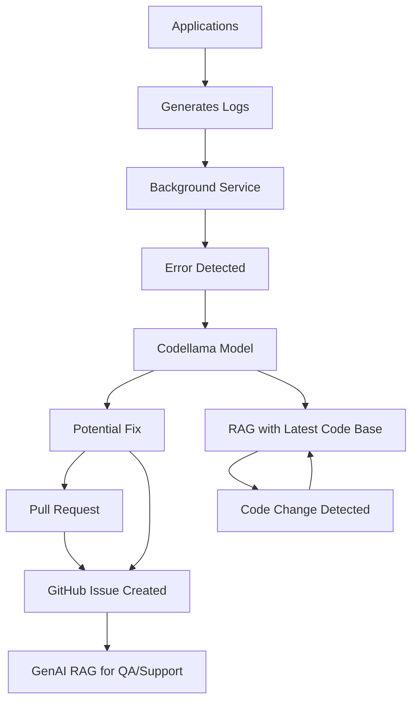

# AI Log Analysis Tool

## Overview
The AI Analysis Tool is an advanced tool designed to assist developers in identifying and resolving issues in their code. By leveraging cutting-edge artificial intelligence, this tool provides suggestions, and fixes for errors, enhancing the overall quality and performance of your codebase.

## Features
- **Log Monitoring**: Check error logs and propose a fix by creating a new branch with the suggested changes.
- **Integration**: Seamlessly integrates with github.

## How It Works
1. **Monitor**: A background service monitors the logs for any errors.
2. **Analyze**: Analyze the error log and stacktrace.
3. **Fix Suggestions**: Create a pull request with the suggested fix.

## Benefits
- Saves time by automating the debugging process.
- Reduces the learning curve for new developers.
- Improves code quality and maintainability.

## Diagram
